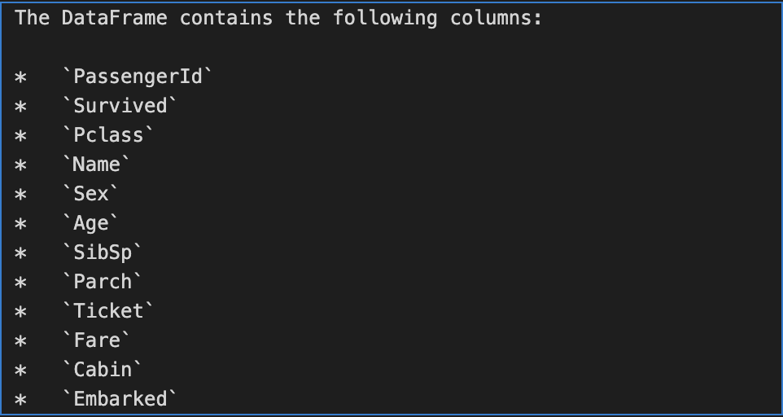
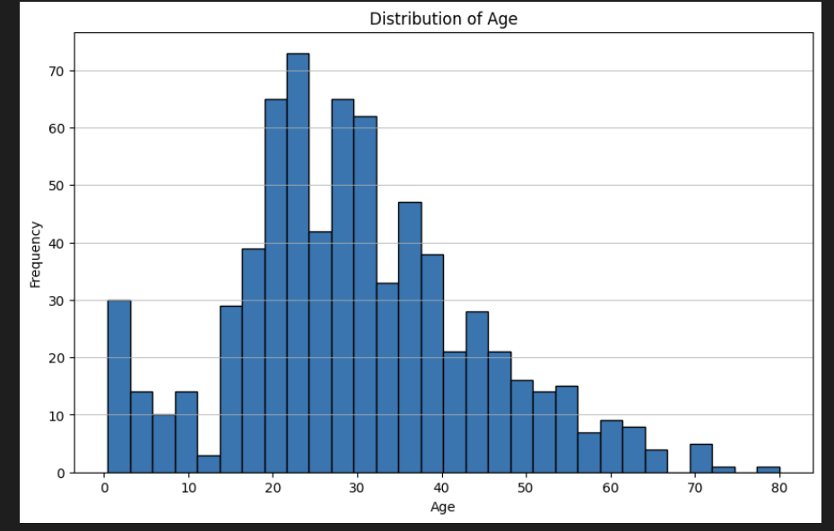

# DataGenie: AI-Powered Data Analysis Agent

DataGenie is an extensible Python package designed to automate and enhance data analysis workflows using Large Language Models (LLMs) and agent-based orchestration. It enables users to interact with their data, generate insights, and visualize results through natural language queries and intelligent agents.

## Project Overview

**Key Capabilities:**
- LLM-powered data analysis and summarization
- Automated data exploration and visualization
- Agent-based orchestration for complex workflows
- Extensible architecture for custom agents and LLMs
- Integration with Gemini and other LLM providers

**Typical Use Cases:**
- Rapid data exploration and summary generation
- Automated report creation
- Interactive data querying and visualization
- Building custom data agents for business intelligence

**How It Works:**
1. Users provide a dataset and a natural language query.
2. DataGenie agents interpret the query, analyze the data, and return results or visualizations.
3. LLMs (like Gemini) are used for reasoning, summarization, and generating code or explanations.

The package is modular, allowing you to add new agents, LLM integrations, or utilities as needed.

## Prerequisites
- Python 3.11+
- Install DataGenie in editable mode:
  ```
  conda activate datagenie && pip install -e .
  ```
- Set your `GOOGLE_API_KEY` as an environment variable for Gemini LLM access.
- Place your dataset (e.g., Titanic-Dataset.csv) in `notebook_io/data_agent/input/`


## Demo Notebook: Step-by-Step Walkthrough

1. **Import Required Libraries and DataGenie Modules**
   - Import standard Python libraries (os, sys, pandas, numpy, etc.)
   - Import DataGenie modules:
     ```python
     from datagenie.utils.llm_agent.agent import Agent
     from datagenie.utils.llm.gemini import Gemini
     from datagenie.datascience.agent import DataAnalystAgent
     ```

2. **Set Data Path and API Key**
   - Define the path to your dataset (e.g., Titanic-Dataset.csv):
     ```python
     data_loc = 'notebook_io/data_agent/input/Titanic-Dataset.csv'
     ```
   - Load your Google Gemini API key from environment variables:
     ```python
     api_key = os.getenv('GOOGLE_API_KEY')
     ```

3. **Initialize Gemini LLM and DataAnalystAgent**
   - Create a Gemini LLM client:
     ```python
     gemini_llm = Gemini(api_key=api_key)
     ```
   - Initialize the DataAnalystAgent with your data and API key:
     ```python
     data_analyst_agent = DataAnalystAgent(data_loc, api_key)
     ```

4. **Run Data Analysis Queries**
   - Get column information:
     ```python
     data_analyst_agent.think('tell me all columns')
     ```
    - Below is the output generated by above query.
    - 


   - Get distribution of the age column:
     ```python
     o = data_analyst_agent.think('give me distribution of age column')
     ```

    - Below is a sample output image generated by the DataAnalystAgent for the age column distribution:

    - 


## Features Demonstrated
- LLM-powered data analysis
- Data summarization and column insights
- Distribution queries

---
For more details, see the notebook: `demo_notebook/data_analyst_agent.ipynb`
